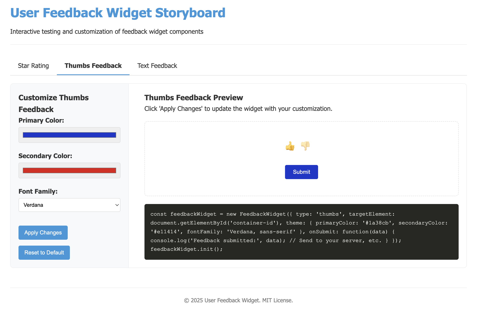

# User Feedback Widget



A lightweight JavaScript widget for collecting user feedback on websites and web applications. This project provides an easy-to-implement solution for gathering user opinions through star ratings, thumbs up/down reactions, and text comments.

## Purpose

The User Feedback Widget helps developers quickly add professional-looking feedback collection mechanisms to their websites. Whether you need simple thumbs up/down reactions, detailed star ratings, or open-ended text feedback, this widget provides a consistent, customizable interface that:

- Improves user engagement by providing an easy way to leave feedback
- Helps gather actionable insights about user experience
- Integrates seamlessly with existing websites and applications
- Provides a consistent look and feel across different feedback types

## Features

- **Multiple Feedback Types**: Support for star ratings, thumbs up/down, and text feedback.
- **Customizable Themes**: Easily customize the widget's appearance to match your site's design.
- **No Dependencies**: Built with vanilla JavaScript for maximum compatibility and performance.
- **Easy Integration**: Simple to embed with just a few lines of code.
- **Lightweight**: Minified size ~5KB for fast loading.
- **UMD Support**: Compatible with various module systems (CommonJS, AMD, global).

## Installation

### Direct Script Include

```html
<script src="dist/feedback-widget.min.js"></script>
```

### NPM

```bash
npm install user-feedback-widget
```

Then import it in your JavaScript:

```javascript
// ES6 module
import FeedbackWidget from 'user-feedback-widget';

// CommonJS
const FeedbackWidget = require('user-feedback-widget');
```

## Building from Source

To build the project from source:

1. Clone the repository:
   ```bash
   git clone https://github.com/yourusername/user-feedback-widget.git
   cd user-feedback-widget
   ```

2. Install dependencies:
   ```bash
   npm install
   ```

3. Build the minified distribution:
   ```bash
   npm run build
   ```

This will generate the minified widget in the `dist/` directory.

## Using the Widget in Your Project

### Basic Implementation

1. Include the widget script in your HTML:
   ```html
   <script src="path/to/feedback-widget.min.js"></script>
   ```

2. Create a container element where you want the widget to appear:
   ```html
   <div id="feedback-container"></div>
   ```

3. Initialize the widget with your preferred configuration:
   ```javascript
   const feedbackWidget = new FeedbackWidget({
     type: 'star', // Choose 'star', 'thumbs', or 'text'
     targetElement: document.getElementById('feedback-container'),
     theme: {
       primaryColor: '#007BFF',
       secondaryColor: '#6C757D',
       fontFamily: 'Arial, sans-serif'
     },
     onSubmit: function(data) {
       console.log('Feedback submitted:', data);
       // Handle the feedback data (e.g., send to your server)
     }
   });
   
   feedbackWidget.init();
   ```

### Handling Feedback Data

The `onSubmit` callback receives the feedback data when a user submits their response. You can use this to:

- Send the data to your server via AJAX
- Store it in localStorage
- Trigger other actions based on the feedback

Example server submission:

```javascript
onSubmit: function(data) {
  fetch('https://your-api.com/feedback', {
    method: 'POST',
    headers: {
      'Content-Type': 'application/json'
    },
    body: JSON.stringify(data)
  })
  .then(response => response.json())
  .then(result => {
    console.log('Feedback saved:', result);
  })
  .catch(error => {
    console.error('Error saving feedback:', error);
  });
}
```

## Configuration Options

The `FeedbackWidget` constructor accepts an options object with the following properties:

### Required Options

- **type** (string): The type of feedback widget to display.
  - `'star'`: A 5-star rating system.
  - `'thumbs'`: Thumbs up/down options.
  - `'text'`: A text area for written feedback (limited to 140 characters).

### Optional Options

- **targetElement** (DOM Element): The element where the widget should be rendered. Defaults to `document.body`.
- **theme** (object): Customization options for the widget's appearance.
  - `primaryColor` (string): The main color for the widget. Default: `'#007BFF'`.
  - `secondaryColor` (string): Secondary color for accents. Default: `'#6C757D'`.
  - `fontFamily` (string): Font family for the widget text. Default: `'Helvetica, Arial, sans-serif'`.
- **onSubmit** (function): Callback function that receives the feedback data when submitted.

## Methods

- **init()**: Initializes and renders the widget. Returns the widget instance for chaining.
- **remove()**: Removes the widget from the DOM.

## Feedback Data Format

The feedback data passed to the `onSubmit` callback has the following format:

```javascript
// Star rating feedback
{
  type: 'star',
  value: '4' // String value from '1' to '5'
}

// Thumbs feedback
{
  type: 'thumbs',
  value: 'up' // 'up' or 'down'
}

// Text feedback
{
  type: 'text',
  value: 'Your service is great!' // User's text input (max 140 chars)
}
```

## Examples

Check out the `/examples` directory for working demonstrations of all feedback types.

### Running the Storyboard

The storyboard is an interactive tool to help you visualize and customize the widgets before implementing them in your project. To run the storyboard:

1. Make sure you have Docker installed on your system.

2. Use the provided Makefile commands:

   ```bash
   # Build and run the storyboard (default port: 8080)
   make story
   
   # To use a different port
   make story PORT=3000
   
   # For development with live updates (mounts your local directory)
   make story USE_VOLUME=1
   
   # To stop the storyboard container
   make story-clean
   
   # For debugging help
   make story-debug
   ```

3. Open your browser to `http://localhost:8080` (or your custom port) to access the storyboard.

The storyboard provides:
- Interactive controls to customize each widget's appearance
- Live previews of all three feedback types
- Generated code snippets based on your customizations
- A tab-based interface to switch between different widget types

This makes it easy to experiment with different themes and configurations before implementing them in your project.

## Browser Compatibility

- Chrome (latest)
- Firefox (latest)
- Safari (latest)
- Edge (latest)
- IE11+ (with appropriate polyfills)

## Development

### Prerequisites

- Node.js (v12+)
- npm (v6+)

### Testing

```bash
# Run tests
npm test
```

## License

MIT
